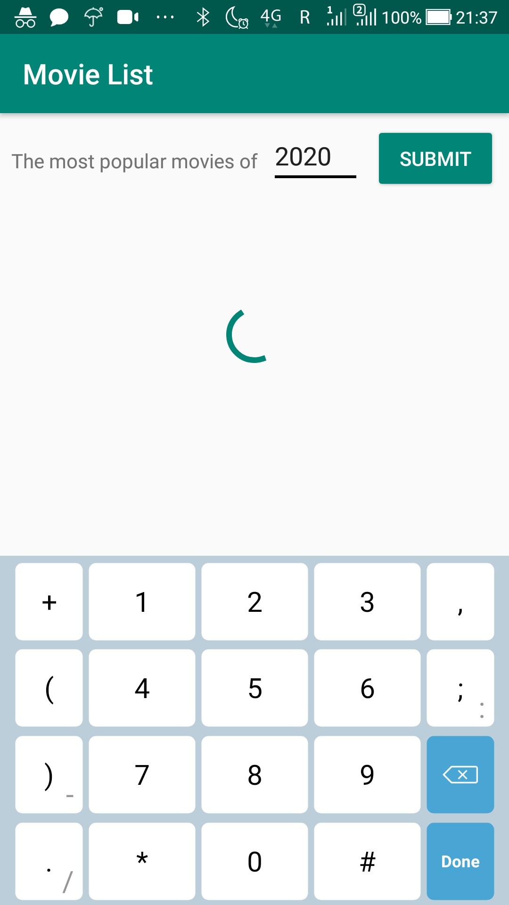
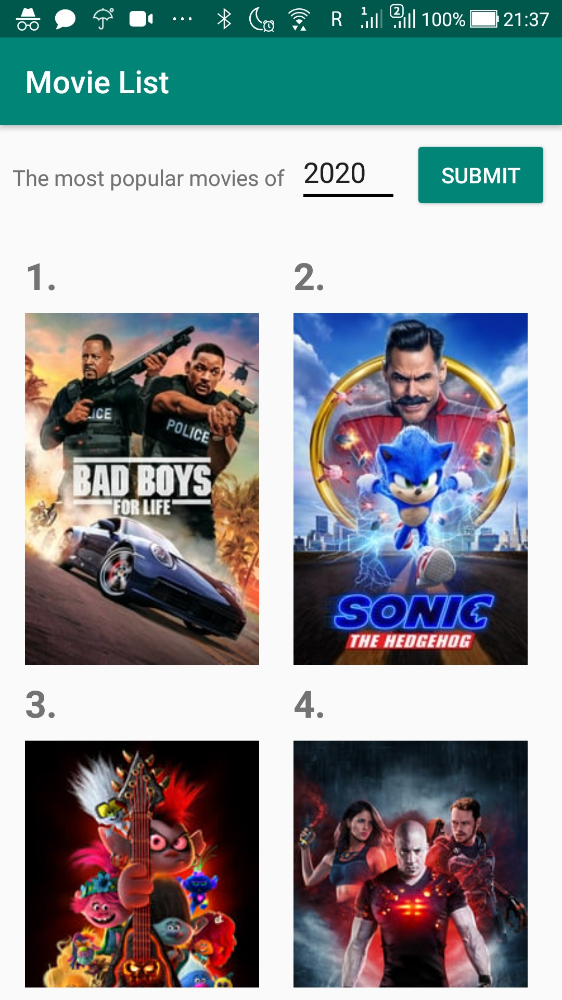
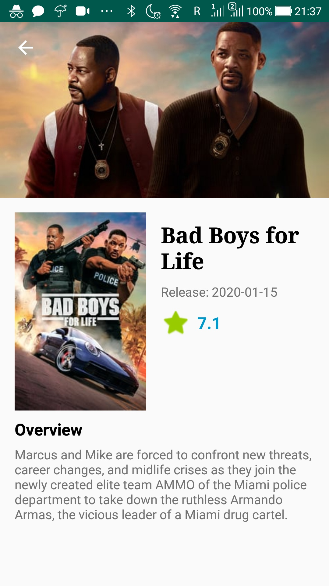
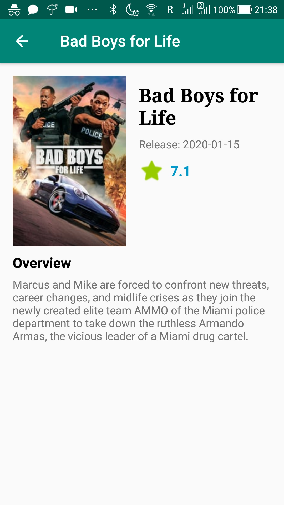
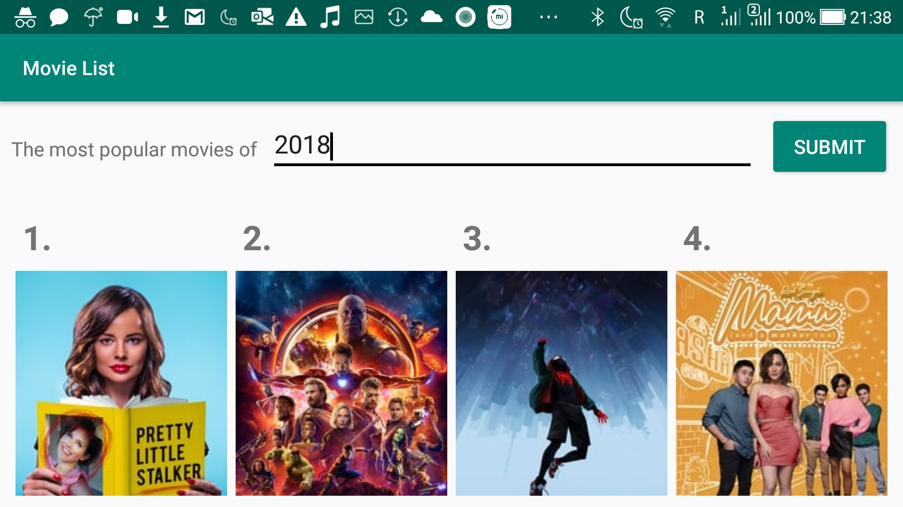

# Level 6 Learning Task 2 - Popular Movies Kotlin
This is an app which displays the most popular movies of a year. This list of movies is retrieved from the api off The Movie Db. Clicking a movie displays more information about the movie.
## What's inside
The following requirements have been met in this app:
* A user can input a year.
* After clicking submit the most popular (English spoken) movies are retrieved from The Movie DB and the movie posters are displayed in a grid formation with their ranking.
* Retrofit, Glide and Architecture Components (LiveData, ViewModel, Repository) are used.
* Clicking on a movie opens a new screen with additional information about the movie. The information a user can see is (Backdrop image; Poster image; Title; Release date; Rating; Overview (plot)).
* The transparent toolbar is implemented with the help of CollapsingToolbarLayout (and it collapses as shown in the screenshots 3-4).
* API key is stored in res/values/secrets.xml which is added to .gitignore.

To make the app more user friendly the following requirements have been added:
* ProgressBar widget is used to display a loading circle when the movies are being fetched.
* The cells of each row increase/decrease depending on the screen size (a big phone/tablet would have a larger grid).
* The change of screen orientation is supported.

## Screenshots
    
    

